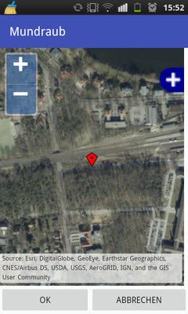

# How to use Fruit Radar

The app is available in at least English and German.

## List your plants

You can scroll though your plants. Some have images, some do not.
If you uploaded a plant, you see the litte globe next to it.

## Add new plants

When you add a new plant, the location is automatically set from GPS
coordinates.
You can choose the type and how many of the plants are there and take a picture.
Once you save the plant, it turns up in the list and you can view the details.

You can choose the type from a list of plants available at [Mundraub.org].

## Log-In for online activities

To upload or delete plants, you need to log in using your [Mundraub.org]
account.

## Upload plants

If you would like to share a plant online, you can do so after login.
The app may ask you to reposition the plant if GPS is too far off.
Then, you can open the map.

## Reposition plants on a map

When you have an Internet connection available, you can use the map to 
set the plant precisely.
This is needed if GPS takes too long to position the plant or if the
GPS position is too far away.

[Mundraub.org]: https://Mundraub.org

